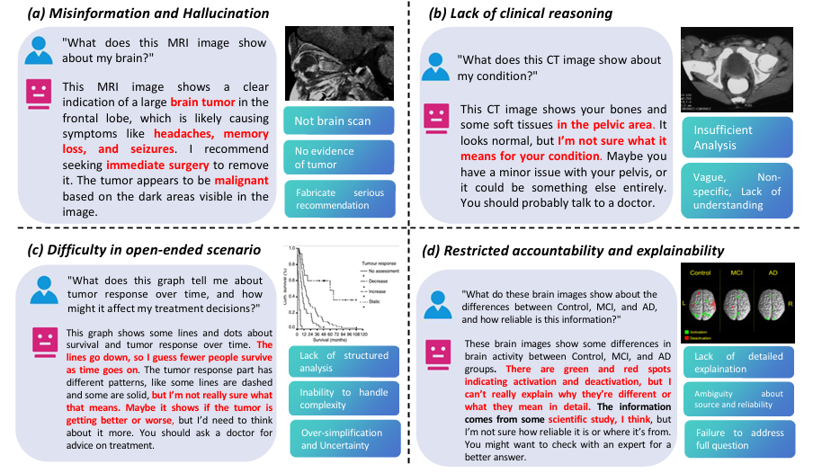
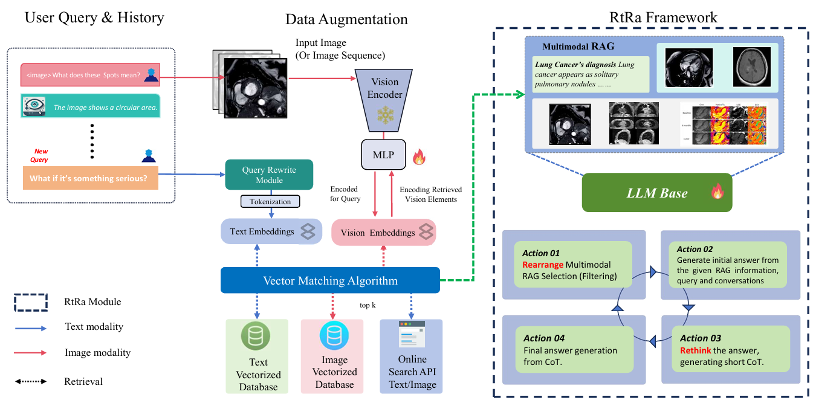
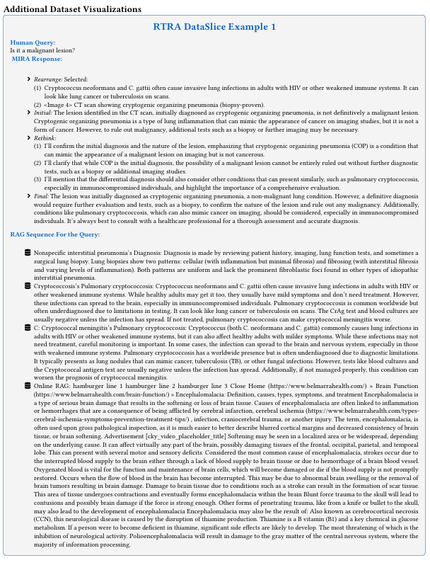

<p align="center">
    
</p>
<!-- centred logo -->
<h1 align="left" style="margin:24px 0;">
  MIRA: A Novel Framework for Fusing Modalities in Medical RAG
</h1>

<!-- bottom full-width GIF -->
<p align="center">
    
</p>

<div align="center">

[](https://arxiv.org/abs/2507.07902)
[](https://huggingface.co/datasets/Tajamul21/Agent-X)
[](https://github.com/Tajamul21/Agent-X-Benchmark/releases/download/v0.1.0/agent-X_dataset.zip)
[](#-)

</div>


#### Authors: [Jinhong Wang](https://scholar.google.com/citations?user=Z_YOUR_ID)\*, [Tajamul Ashraf](https://www.tajamulashraf.com)\*, [Zongyan Han](https://scholar.google.com/citations?user=Z_YOUR_ID), [Jorma Laaksonen](https://people.aalto.fi/jorma.laaksonen), [Rao Muhammad Anwer](https://mbzuai.ac.ae/study/faculty/rao-muhammad-anwer/)


\* Equal contribution, **Correspondence:** [Tajamul Ashraf](https://www.tajamulashraf.com)
<div align="left" style="margin:24px 0;">
  
</div>


## Updates

- **[2025-07-09]**: 🎉 MIRA paper **accepted at [ACM Multimedia 2025](https://acmmm.org/2025)**  
- **[2025-06-02]**: MIRA paper published on [arXiv:2507.07902](https://arxiv.org/abs/2507.07902)  
- **[2025-05-29]**: Released **evaluation & deployment code** for MIRA  
- **[2025-05-22]**: Published the **MIRA dataset on [Hugging Face](https://huggingface.co/datasets)**  


## Introduction

Multimodal Large Language Models (MLLMs) have significantly advanced AI-assisted medical diagnosis, but they often generate factually inconsistent responses that deviate from established medical knowledge. Retrieval-Augmented Generation (RAG) enhances factual accuracy by integrating external sources, but it presents two key challenges. First, insufficient retrieval can miss critical information, whereas excessive retrieval can introduce irrelevant or misleading content, disrupting model output. Second, even when the model initially provides correct answers, over-reliance on retrieved data can lead to factual errors. 

<div align="center">
 
</div>

## What is MIRA?

We introduce the Multimodal Intelligent Retrieval and Augmentation (MIRA) framework, designed to optimize factual accuracy in MLLM. MIRA consists of two key components: (1) a calibrated Rethinking and Rearrangement module that dynamically adjusts the number of retrieved contexts to manage factual risk, and (2) A medical RAG framework integrating image embeddings and a medical knowledge base with a query-rewrite module for efficient multimodal reasoning. This enables the model to integrate both its inherent knowledge and external references effectively. Our evaluation of publicly available medical VQA and report generation benchmarks demonstrates that MIRA substantially enhances factual accuracy and overall performance, achieving new state-of-the-art results.


<div align="center">
 
</div>


---

### Evaluation Scripts  

To be released...


<div align="center">
 
</div>


## 📝 Citation
If you use Agent-Xin your research, please cite the following paper:
```
@misc{mira,
      title={MIRA: A Novel Framework for Fusing Modalities in Medical RAG}, 
      author={Jinhong Wang and Tajamul Ashraf and Zongyan Han and Jorma Laaksonen and Rao Mohammad Anwer},
      year={2025},
      eprint={2507.07902},
      archivePrefix={arXiv},
      primaryClass={cs.CV},
      url={https://arxiv.org/abs/2507.07902}, 
}

```


